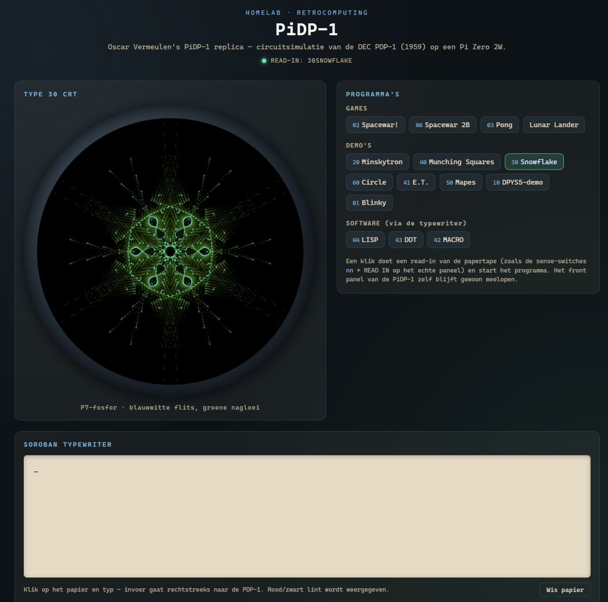
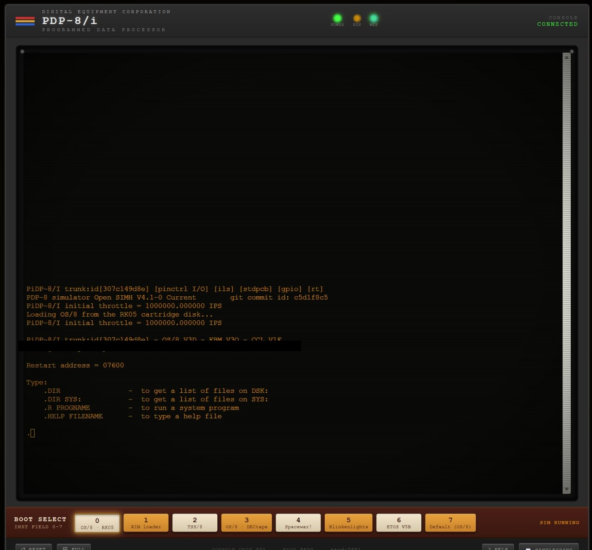
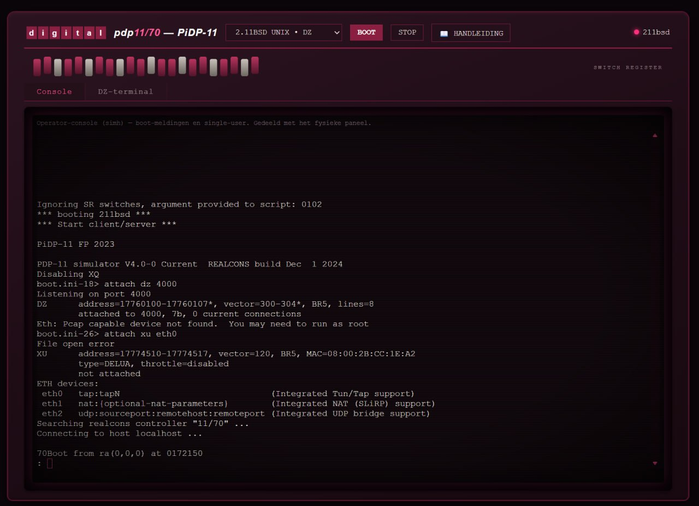

# PiDP Web Consoles

Browser-based web consoles for Oscar Vermeulen's [PiDP](https://obsolescence.dev/pidp10/) replica kits — PiDP-1, PiDP-8/I, PiDP-10, and PiDP-11. Each one runs on the Raspberry Pi that drives the physical front panel and exposes the machine's console (and, where relevant, boot selection) as a page in your browser, alongside the real hardware panel — not instead of it. Both stay in sync.

Built by a home-lab PiDP owner (all four kits) who wanted browser access to each machine without giving up the physical panel experience. Shared because Oscar Vermeulen, seeing these in use, suggested the community might get some use out of them.

## What's in here

| Directory | Machine | What it adds |
|---|---|---|
| [`pidp10/`](pidp10/) | PiDP-10 (KLH10) | FastAPI + xterm.js console, telnet bridge to the operator console, periodic screenshots of the Knight TV / Type 340 display |
| [`pidp11/`](pidp11/) | PiDP-11 | FastAPI + xterm.js, two bridges: operator console (`screen`) and a DZ11 login-terminal line, OS picker |
| [`pidp8i/`](pidp8i/) | PiDP-8/I (SimH) | Adds a boot-select HTTP API and a small status page on top of the existing ttyd-based web terminal |
| [`pidp1/`](pidp1/) | PiDP-1 (SimH) | A compact console page with one-click program loading (READ IN pulse) on top of Oscar's own PiDP-1 web kit software |

Each directory has its own README with the specific architecture, dependencies, and install notes for that machine.

## Screenshots

| PiDP-1 | PiDP-8/I |
|---|---|
|  |  |

| PiDP-10 | PiDP-11 |
|---|---|
| _coming soon_ |  |

## Shared design

- **Panel and browser share one session.** None of these spin up a second, independent emulator instance — they attach to the same `screen`/telnet session the physical front panel already uses. Whatever you do from the browser, the panel sees too (and vice versa).
- **No new emulators, no new protocols.** Each console is a thin FastAPI/Python/Go layer in front of the SimH/KLH10 instance that's already running for the physical kit.
- **Network-agnostic by design.** Everything binds to `0.0.0.0` on its own port and reads its own hostname from the incoming request (`window.location.hostname` client-side) rather than a hardcoded address — so it works whether you reach the Pi directly, through a reverse proxy, or over Tailscale. If your Pis are split across network segments (e.g. wired vs. wifi), a simple `socat`/`frp`-style TCP forward on a shared host works fine; that's an infrastructure choice outside the scope of this repo.

## Requirements

- A working PiDP-1 / PiDP-8/I / PiDP-10 / PiDP-11 kit, built and running per Oscar Vermeulen's own instructions and software ([obsolescence.dev](https://obsolescence.dev/)).
- Python 3 + the packages listed in each subfolder's README (FastAPI, uvicorn, websockets — all installed in a venv, nothing system-wide).
- For PiDP-1: Oscar's own PiDP-1 web kit software already installed (`p7sim.js`, `papertape.js`, the Go server) — this repo's `pidp1/` adds a console page and a READ IN helper service alongside it, it doesn't replace it.

## Credits

- **Oscar Vermeulen** ([obsolescence.dev](https://obsolescence.dev/)) designed and sells the PiDP kits themselves, and wrote the original PiDP-1 web front-end (`p7sim.js`, `papertape.js`) that `pidp1/` builds on.
- The SimH / KLH10 emulation underneath all four consoles is the existing, separately-maintained emulator software for each machine — not part of this repo.

## License

The code in this repo (the FastAPI/Python backends, the console HTML/JS written for this project, and the systemd unit examples) is released under the MIT license — see [LICENSE](LICENSE). Files carried over from Oscar Vermeulen's own PiDP-1 kit distribution (see `pidp1/README.md`) remain his; check with him directly if you want to redistribute those further.

## Status

This is home-lab software, shared as-is. It works reliably for the author's own setup; your mileage with different Pi models, OS images, or kit revisions may vary. Issues and PRs welcome.
